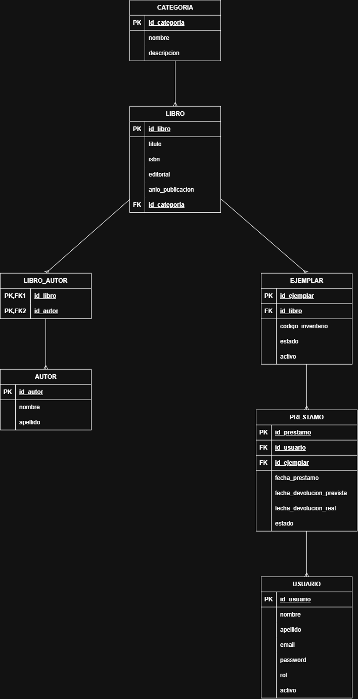

# Base de Datos - BiblioGest

## Descripción

BiblioGest utilizará una base de datos relacional MySQL para almacenar y organizar la información necesaria para la gestión de la biblioteca.

El modelo fue pensado a partir de las funcionalidades definidas para el Producto Mínimo Viable (MVP), principalmente la gestión de usuarios, libros, autores, categorías, ejemplares, préstamos y devoluciones.

La base de datos permitirá mantener centralizada la información y representar las relaciones existentes entre los distintos elementos del sistema.

## Entidades principales

Para el desarrollo inicial se definieron las siguientes entidades:

- Usuario
- Libro
- Autor
- Categoría
- Ejemplar
- Préstamo
- Libro_Autor

La entidad Libro_Autor se utilizará como tabla intermedia para representar la relación entre libros y autores, ya que un libro puede tener uno o más autores y un autor puede estar asociado a diferentes libros.

## Tabla Usuario

Almacena la información de las personas registradas en el sistema.

Campos principales:

- id_usuario: identificador único del usuario.
- nombre: nombre del usuario.
- apellido: apellido del usuario.
- email: correo electrónico utilizado para identificar al usuario.
- password: contraseña de acceso al sistema.
- rol: indica si el usuario es Bibliotecario/Administrador o Lector.
- activo: indica si el usuario se encuentra activo en el sistema.

## Tabla Categoria

Permite clasificar los libros del catálogo.

Campos principales:

- id_categoria: identificador único de la categoría.
- nombre: nombre de la categoría.
- descripcion: información adicional de la categoría.

## Tabla Autor

Almacena los autores correspondientes a los libros registrados.

Campos principales:

- id_autor: identificador único del autor.
- nombre: nombre del autor.
- apellido: apellido del autor.

## Tabla Libro

Representa la información bibliográfica general de cada libro.

Campos principales:

- id_libro: identificador único del libro.
- titulo: título del libro.
- isbn: código ISBN del libro, cuando se encuentre disponible.
- editorial: editorial del libro.
- anio_publicacion: año de publicación.
- id_categoria: categoría a la que pertenece el libro.

## Tabla Libro_Autor

Representa la relación entre libros y autores.

Campos principales:

- id_libro: referencia al libro.
- id_autor: referencia al autor.

La combinación de ambos campos permitirá asociar varios autores a un libro y varios libros a un mismo autor.

## Tabla Ejemplar

Representa cada copia física disponible de un libro.

Campos principales:

- id_ejemplar: identificador único del ejemplar.
- id_libro: libro al que corresponde el ejemplar.
- codigo_inventario: código utilizado para identificar físicamente el ejemplar.
- estado: indica la situación del ejemplar, por ejemplo DISPONIBLE o PRESTADO.
- activo: permite indicar si el ejemplar continúa formando parte de la biblioteca.

La separación entre Libro y Ejemplar permite que un mismo libro tenga varias copias físicas.

## Tabla Prestamo

Registra los préstamos realizados en la biblioteca.

Campos principales:

- id_prestamo: identificador único del préstamo.
- id_usuario: usuario que recibe el ejemplar.
- id_ejemplar: ejemplar prestado.
- fecha_prestamo: fecha en que se realiza el préstamo.
- fecha_devolucion_prevista: fecha prevista para su devolución.
- fecha_devolucion_real: fecha en que el ejemplar fue efectivamente devuelto.
- estado: situación actual del préstamo, por ejemplo ACTIVO o DEVUELTO.

Cuando se registra un préstamo, solamente podrá seleccionarse un ejemplar que se encuentre disponible.

Al registrarse la devolución, se completará la fecha de devolución real y el ejemplar volverá a estar disponible.

## Relaciones principales

Las relaciones definidas inicialmente son:

- Una Categoría puede tener muchos Libros.
- Un Libro pertenece a una Categoría.
- Un Libro puede tener uno o varios Autores.
- Un Autor puede estar asociado a uno o varios Libros.
- Un Libro puede tener varios Ejemplares.
- Un Ejemplar pertenece a un único Libro.
- Un Usuario puede realizar varios Préstamos.
- Un Préstamo corresponde a un único Usuario.
- Un Ejemplar puede aparecer en distintos Préstamos a lo largo del tiempo.
- Cada Préstamo corresponde a un único Ejemplar.

## Reglas de negocio principales

Para mantener la consistencia de la información se consideran inicialmente las siguientes reglas:

1. No se podrá registrar un préstamo sobre un ejemplar que ya se encuentre prestado.
2. Cuando se registre un préstamo, el ejemplar deberá pasar al estado PRESTADO.
3. Cuando se registre una devolución, el ejemplar deberá volver al estado DISPONIBLE.
4. Cada ejemplar deberá estar asociado a un libro existente.
5. Cada préstamo deberá estar asociado a un usuario y a un ejemplar existentes.
6. Los usuarios tendrán diferentes permisos de acuerdo con su rol.
7. La fecha de devolución real permanecerá vacía mientras el préstamo continúe activo.

## Tipo de base de datos

Se utilizará MySQL como sistema de gestión de base de datos relacional.

La elección de un modelo relacional permite representar mediante claves primarias y foráneas las relaciones existentes entre usuarios, libros, autores, categorías, ejemplares y préstamos.

## Diagrama Entidad-Relación

El modelo será representado mediante un Diagrama Entidad-Relación (DER), donde se visualizarán las entidades, sus principales atributos, claves primarias, claves foráneas y cardinalidades.

El siguiente diagrama representa las entidades principales del sistema BiblioGest, sus atributos, claves primarias, claves foráneas y las relaciones definidas para el modelo de datos.

## Script de creación de la base de datos

Además del diseño del modelo, se creó el script SQL inicial de la base de datos de BiblioGest. Este archivo permite crear la base de datos, sus tablas, claves primarias, claves foráneas y las relaciones definidas en el modelo.

El script fue probado en MySQL Workbench para verificar su correcta ejecución y la creación de las tablas correspondientes.

📄 [Ver script SQL de BiblioGest](schema.sql)
