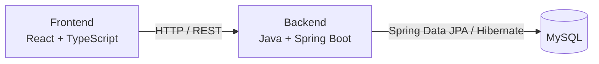

# Módulos del Sistema - BiblioGest

## Introducción

BiblioGest se organizará en diferentes módulos, cada uno con una responsabilidad específica dentro del sistema. Esta división permitirá mantener el proyecto ordenado y facilitar su desarrollo, mantenimiento y futuras modificaciones.

## Arquitectura general

BiblioGest utilizará una arquitectura cliente-servidor. El frontend, desarrollado con React y TypeScript, será responsable de la interfaz con los usuarios y se comunicará con el backend mediante una API REST sobre HTTP. El backend, desarrollado con Java y Spring Boot, concentrará las reglas de negocio y será responsable del acceso y la manipulación de los datos. Para la persistencia se utilizarán Spring Data JPA y Hibernate, mientras que MySQL almacenará la información del sistema.

## 1. Módulo de Usuarios

Permitirá administrar los usuarios que utilizarán el sistema.

Funciones principales:

- Registrar usuarios.
- Consultar usuarios registrados.
- Modificar datos de los usuarios.
- Realizar baja lógica de usuarios.
- Diferenciar permisos según el rol del usuario.

## 2. Módulo de Catálogo

Permitirá al Bibliotecario/Administrador gestionar y mantener la información bibliográfica de los libros de la biblioteca.

Funciones principales:

- Registrar libros.
- Modificar información de libros.
- Consultar libros desde las funciones administrativas.
- Mantener actualizada la información bibliográfica.
- Organizar los libros por categorías y autores.

## 3. Módulo de Ejemplares

Permitirá controlar los ejemplares físicos disponibles de cada libro.

Funciones principales:

- Registrar ejemplares.
- Asociar cada ejemplar con un libro.
- Identificar cada ejemplar mediante un código de inventario.
- Consultar el estado de un ejemplar.
- Gestionar el estado de cada ejemplar según su disponibilidad.

## 4. Módulo de Préstamos y Devoluciones

Permitirá gestionar la circulación de los ejemplares de la biblioteca.

Funciones principales:

- Registrar un préstamo.
- Asociar el préstamo con un usuario y un ejemplar.
- Registrar la fecha del préstamo.
- Registrar la fecha prevista de devolución.
- Registrar la devolución del ejemplar.
- Consultar préstamos activos.
- Consultar préstamos finalizados.

## 5. Módulo de Autenticación y Roles

Permitirá controlar el acceso al sistema.

Funciones principales:

- Iniciar sesión.
- Validar las credenciales del usuario.
- Identificar el rol del usuario.
- Restringir funcionalidades según los permisos correspondientes.

## 6. Módulo de Consulta del Catálogo

Permitirá que los lectores visualicen y busquen de manera sencilla el material disponible en la biblioteca, sin acceder a las funciones administrativas de mantenimiento del catálogo.

Funciones principales:

- Visualizar el catálogo.
- Buscar libros por título, autor o categoría.
- Consultar información básica de cada libro.
- Consultar si existen ejemplares disponibles.

## Dependencias principales entre módulos

Los módulos presentan las siguientes dependencias funcionales:

- Préstamos y Devoluciones depende de Usuarios y Ejemplares para identificar al lector y al ejemplar asociados a cada préstamo.
- Ejemplares depende del Catálogo, porque cada ejemplar debe pertenecer a un libro.
- Consulta del Catálogo utiliza información proveniente del Catálogo y de Ejemplares para mostrar los libros y su disponibilidad.
- Autenticación y Roles controla el acceso a las funcionalidades del sistema según el rol del usuario.
- El módulo de Catálogo utiliza la información de autores y categorías para organizar y clasificar los libros.

Estas dependencias representan relaciones funcionales entre los módulos y no implican que sean microservicios ni componentes independientes desplegables.

## Organización general

Cada módulo tendrá responsabilidades específicas y se relacionará con los demás cuando una funcionalidad lo requiera. Esta separación busca facilitar el desarrollo y el mantenimiento del sistema, pero no significa que los módulos sean aplicaciones o servicios independientes.
